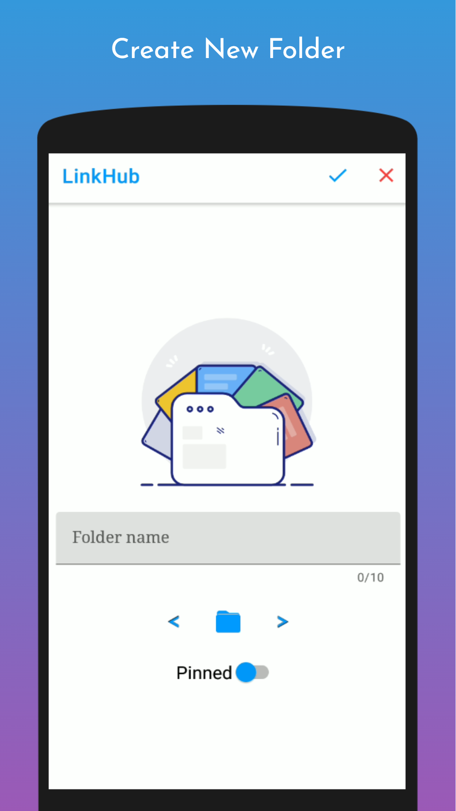
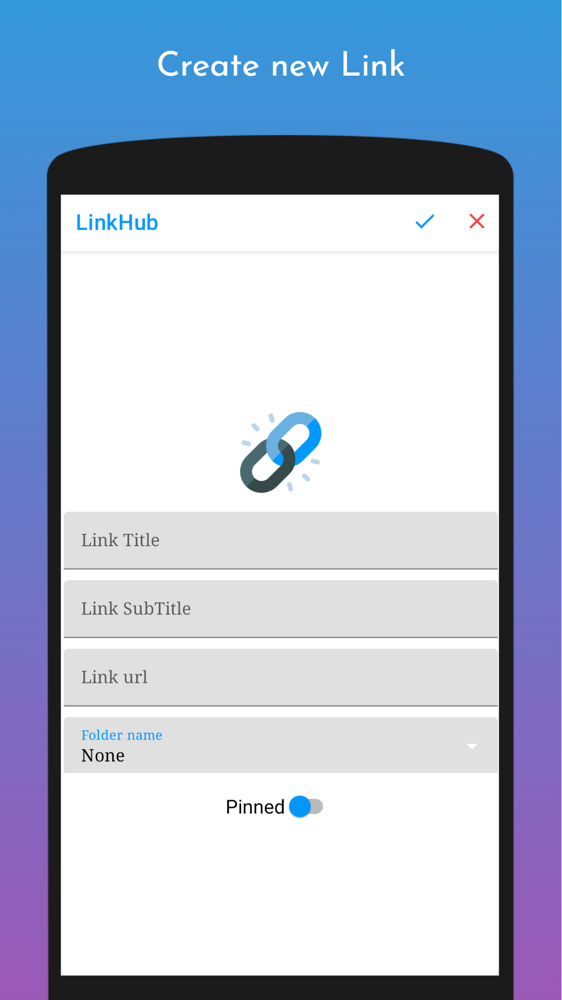

<h1 align="center">LinkHub</h1></br>

<p align="center">

</p>

<p align="center">
A simple and effective link management app that help you to easily manage your own links without ads,
Linkhub help you to organize and access links fast and easily, it automatically sorted elements depend on how many time you used them,
you can copy, edit, open your link just by one click
</p>


[](https://www.codacy.com/gh/AmrDeveloper/LinkHub/dashboard?utm_source=github.com&amp;utm_medium=referral&amp;utm_content=AmrDeveloper/LinkHub&amp;utm_campaign=Badge_Grade)
[](https://www.codefactor.io/repository/github/amrdeveloper/linkhub)
[](https://github.com/amrdeveloper/linkhub/releases/latest)
[](https://android-arsenal.com/details/3/8305)

## Download
<p align="center">
<a href='https://play.google.com/store/apps/details?id=com.amrdeveloper.linkhub'></a>
<a href="https://galaxystore.samsung.com/detail/com.amrdeveloper.linkhub"></a>
<a href="https://www.amazon.com/gp/product/B09B19R8K5"></a>
<a href="https://appgallery.huawei.com/#/app/C104553823"></a>
</p>

## Screenshots
<p align="center">



</p>

## Features
- Free And open source with no ads
- Create Folder with name and multi colors
- Create Link with title, subtitle, url
- Links and Folders are sorted depending on your usage
- Search easily in links and folders
- Shortcuts, Context menu and receive links from other apps
- Auto generated title and subtitle for shared links
- Swipe to delete links on Home with undo option
- Dark theme support
- Import and Export the data in JSON Format
- Widget for Pinned links

## Supported languages
- Arabic
- English
- German
- Chinese
- Vietnamese
- Russian

## How to contribute
- Before making a feature request or bug report make sure you have the latest version installed on your device and the request is unique
- If you want to implement new feature or solving bug make sure no one working on this issue and left a comment that you will work on it

```
MIT License

Copyright (c) 2021 Amr Hesham

Permission is hereby granted, free of charge, to any person obtaining a copy
of this software and associated documentation files (the "Software"), to deal
in the Software without restriction, including without limitation the rights
to use, copy, modify, merge, publish, distribute, sublicense, and/or sell
copies of the Software, and to permit persons to whom the Software is
furnished to do so, subject to the following conditions:

The above copyright notice and this permission notice shall be included in all
copies or substantial portions of the Software.

THE SOFTWARE IS PROVIDED "AS IS", WITHOUT WARRANTY OF ANY KIND, EXPRESS OR
IMPLIED, INCLUDING BUT NOT LIMITED TO THE WARRANTIES OF MERCHANTABILITY,
FITNESS FOR A PARTICULAR PURPOSE AND NONINFRINGEMENT. IN NO EVENT SHALL THE
AUTHORS OR COPYRIGHT HOLDERS BE LIABLE FOR ANY CLAIM, DAMAGES OR OTHER
LIABILITY, WHETHER IN AN ACTION OF CONTRACT, TORT OR OTHERWISE, ARISING FROM,
OUT OF OR IN CONNECTION WITH THE SOFTWARE OR THE USE OR OTHER DEALINGS IN THE
SOFTWARE.
```
